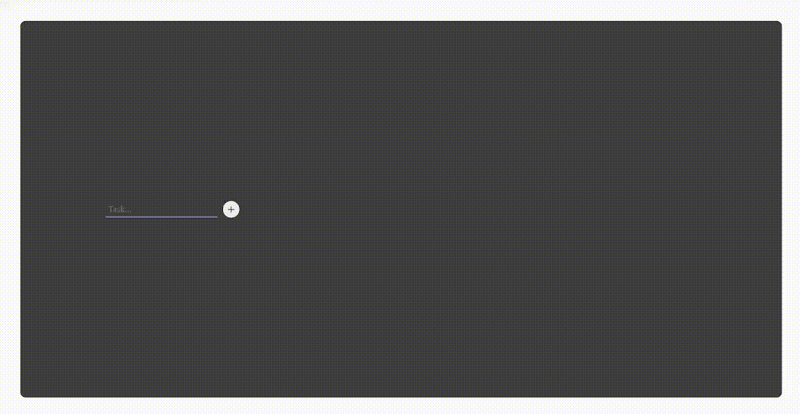

# Todo-Micro-Frontend

This repository is a Todo list app using micro-frontend.

## Demo



## Tech Stack

- Garfish: a library for creating micro-frontend apps
- Vue 3 + React 17: frontend framework

## How to run

```sh
yarn start
```
